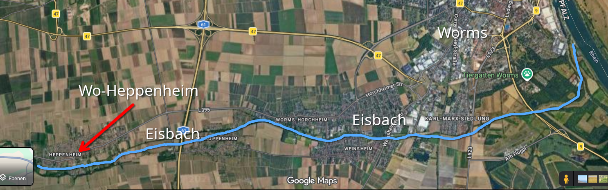

# Pegel für Bäche in RLP 🌊

Skript zum Abrufen von Wasserständen für Bäche und Flüsse in Rheinland-Pfalz.

## Über dieses Projekt

Dieses Projekt basiert auf einem Vibecode von **Grok**, den ich leicht angepasst habe.

## Installation

```bash
pip install playwright
playwright install chromium
```

## Verwendung

```bash
python wasserstand.py
```

Das Skript lädt Wasserstandsdaten von der Seite geodaten-wasser.rlp-umwelt.de und extrahiert die relevanten Informationen.


## Features

- 🌊 Automatisches Abrufen von Wasserständen
- 🤖 Verwendet Playwright für Browsersimulation
- ⏱️ Wartet auf vollständiges Laden der Seite
- 📊 Extrahiert Daten aus dynamisch geladenem Inhalt

## Verfügbare Gewässer

- Eisbach bei Worms-Heppenheim aktiviert
- Pfrimm bei Worms-Pfeddersheim auskommentiert
- Weitere können durch URL-Anpassung hinzugefügt werden
